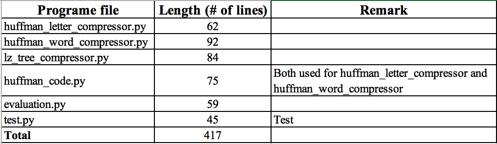

# Report - Data compression project

- [Report - Data compression project](#report---data-compression-project)
  - [1. Implementation and results](#1-implementation-and-results)
    - [1.1 Letter-level Huffman compressor](#11-letter-level-huffman-compressor)
    - [1.2 Word-level Huffman compressor](#12-word-level-huffman-compressor)
    - [1.3 Lempel-Ziv compressor](#13-lempel-ziv-compressor)
  - [2. Evaluation](#2-evaluation)
    - [2.1 Compare across implemented compressors](#21-compare-across-implemented-compressors)
    - [2.2 Compare with existing compressor](#22-compare-with-existing-compressor)
    - [2.3 Evaluate program length](#23-evaluate-program-length)
  - [3. Discussion](#3-discussion)
  - [References:](#references)

Using Python, I've implemented 3 text compressor, which are the Letter-level Huffman compressor, the Word-level Huffman compressor and the Lempel-Ziv compressor.
The result shows that my implemented Word-level Huffman compressor has close performance to MacBook default compressing tool.
In the following report, Section 1 will describe the implementation.
Section 2 will present the evaluation results.
Section 3 is further discussion.

## 1. Implementation and results

### 1.1 Letter-level Huffman compressor

There are several key steps to use letter-level Huffman coding for text compression, which are listed as follows:

1. Estimate probability for each letter
2. Build Huffman Tree
3. Assign codes for each letter
4. Encode and decode

Next, I will describe what's important for each step

**Estimate probability for each letter:**
The more corpus we have, the more accurate our estimated result is.
My strategy is to read all provided text file, then count for every unique character, and use their occurrence rates as the probabilities.
For real-world application, we can use larger corpus to estimate better result.
But this is enough for my experiment.

**Huffman tree:**
The next step is to build the Huffman tree, which is the core for this algorithm.
I use a 2-D array (table) data structure to store this tree.
The tree is initialized with the result of the last step (estimated probabilities for each characters).
Then, two nodes with the minimum probabilities merged iteratively, until we have the full tree (only the root node has no parents).
Figure 1 shows part of the tree.

  
  
Figure 1: Letter-level Huffman tree and assigned codes

In Figure 1, each row represents a node in the tree.
The `name` column indicates whether the node is the leaf node or the middle node.
The `prob` column is the associated probability of the node.
The `code` column is the code assigned to each node, which is the result of the next step.
The `leftchild` and `rightchild` column represent the indices of right-child and left-child for the node.
And the `adopted` column indicates whether the current node has parent node.

**Assign Huffman codes:**
To assign codes, we can use BFS to traverse the tree from the root node.
For each traverse step, we append a `0` or `1` to the code until we reach the leaf node.
The last column of the table in Figure 1 is the assigned codes for each character.
Totally, there are 98 unique characters for my corpus.
From Figure 1, we can see some example codes, and we only care about the codes for leaf nodes.
Also, we can also see that codes for characters with higher probability are shorter (e.g. the code `00` for space is much shorter than `*`'s `01110110101`).

These codes can be cached for later use, which means we don't need to repeat the above for each encoding and decoding process.
*Actually, I don't think we should embed the dictionary to the encoded file (as mentioned in the project description).*
Since this dictionary is for general usage, not for a particular file.

**Encoding and decoding process:**
The encoding process is easy. We just map each character to its binary code, and concatenate all codes to a binary stream. Finally, we write the binary stream to a binary file.

The decoding process is the reverse process. The input binary stream is uniquely decodable. We should check whether the first bits are recorded in the Huffman code dictionary, and then substitute with the corresponding character.

How to deal with `bit stream` might be a problem for this step. Python `bitarray` package is an excellent solution, which can handle bit stream like common arrays.

### 1.2 Word-level Huffman compressor

For word-level Huffman coding, the whole process is almost the same as letter-level Huffman coding.
But some differences are highlighted here.

**Estimate probability for each word:**
The first problem is how should we segment text string into words.
My strategy is:
* If the current character is a English letter, find the longest sub-string beginning with current character which contains all English letters, and treat this sub-string as a word.
* If the current character is not a English letter, treat this character as a word.

The `probability` is also different from the Letter-level coding.
For a word unit, we should compute how much percent its characters occupy the whole corpus. Since we want to minimize the average code length per character, we should take account of the length of the word, not only its occurrent rate.

After we have the probability dictionary, we can build Huffman Tree and assign Huffman code like Letter-level Huffman coding. Figure 2 shows part of the result tree and assigned codes.

  
  
Figure 2: Word-level Huffman tree and assigned codes

From Figure 2, we see that the space character has the shortest code, and commonly-used words like `The`
and `of` have shorter than uncommon words like `Edition`.

The final Huffman tree has the same data structure like the previous one.
It has about `40000` leaf nodes, which means we have about `40000` words to encode (special characters are also treated as words).
Therefore, the final code dictionary has around `40000` items.
Although it is large, we don't need to embed it to the encoded file, since it is for general use.
In real-world application, this dictionary can be embed to the encoder and decoder program, and it can be used for all text files.

The **encoding and decoding process** are similar to the Letter-level coding.

### 1.3 Lempel-Ziv compressor

I choose to use the tree-based Lempel-Ziv coding.
I've referred to Chapter 6.4 of [1] for details.
Lempel-Ziv coding is a kind of stream code.
We can directly perform encoding and decoding based on the input, without any preparation work

The encoding process includes following steps
1. *Split the input bit stream to sub-sequences of bits.* According to tree-based Lempel-Ziv algorithm, from the beginning of the stream, we cut sub-sequences which didn't appear before.
2. *Convert the sub-sequences to `(pointer, bit)` tuples.* Each sub-sequence should be represented with the index of its prefix sequence and the its final bit.
3. *Convert the `(pointer, bit)` array to binary stream.* One thing to mention here is that, the bits used to represent pointer value should be $log_2 (s)$, where $s$ is the index of the tuple in the `(pointer, bit)` array. This is for the purpose of uniquely decodable. Finally, the binary stream is written to a file as the compressed result.

The decoding process is totally the inverse process for encoding:
1. *Convert the input binary stream `(pointer, bit)` array.*
2. *Convert the (pointer, bit) array to sub-sequences of bits.*
3. *Concatenate sub-sequences of bits to recover the original bit stream*

  
  
Figure 3: Tree-based Lempel-Ziv encoding and decoding

Figure 3 shows and simple example.
Since the original bit stream is short and doesn't have much redundancy, the compressed output is even longer. But for longer stream, the result will be different.

## 2. Evaluation

Figure 4 shows the evaluation result.

  
  
Figure 4: Evaluation results 

### 2.1 Compare across implemented compressors

From Figure 4, we see that the Word-level Huffman compressor has much better compress ratio than the Letter-level Huffman compressor and the Lempel-Ziv compressor.
Its average compress ratio is 36.4%.
Perhaps it is because it utilizes the redundancy of English words well for these files.

The Letter-level Huffman compressor ranks the second. The average compress ratio is 58.9%, almost 2 times of the Word-level Huffman compressor.

The Lempel-Ziv compressor has the worst compress ratio for these files (69.7%).
However, we see that the larger the file is, the lower the compress ratio is for Lempel-Ziv compressor.
This is because longer bit streams are more likely to have bigger redundancy.
Maybe for larger files, the Lempel-Ziv compressor will achieve the best performance.

### 2.2 Compare with existing compressor

I also compress the test files with my computer's (MacBook Pro) default compress program, and the results are list in Figure 4.

We see that its average compress ratio is 34.9%, a little lower than the Word-level Huffman compressor.
For some files, my Word-level Huffman compressor can even achieve better compress ratio, which is highlighted in Figure 4.

### 2.3 Evaluate program length

Here is short summary for my program length.
The Lempel-Ziv compressor is the easiest to implement, with the least program length.
Since there is no separation between modeling and coding for it, we just need to write the encoding and decoding function.

  
  
Figure 5: Evaluation for program length 

## 3. Discussion

All my implemented compressor has no recovery error.
From the compressed file, the original file can be fully recover without error.

## References:

1. MacKay, David JC, and David JC Mac Kay. Information theory, inference and learning algorithms. Cambridge university press, 2003.
